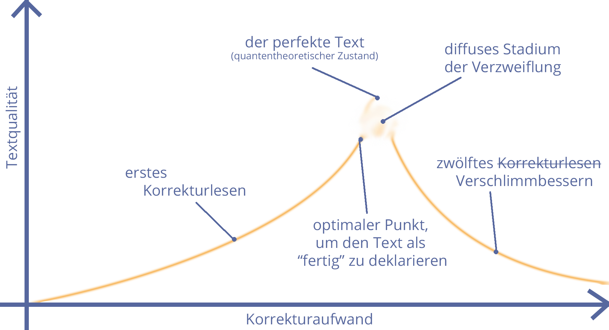

    <h2 style="display: inline">Schreiben ist leicht. Du musst nur die falschen Wörter weglassen.</h2> <em>(Mark Twain)</em>

---
## 3 Tipps für bessere Texte:

1. Fass dich kurz!

2. Schreib aktiv und ansprechend!

3. Show, don't tell!

4. Überrasch die Lesenden!

Note:
Die vier besten Top-3-Tipps für bessere Texte!
---
## 1. Kurz fassen 🔽

1. KURZ FASSEN

## Wenn einem Autor der Atem ausgeht, werden die Sätze nicht kürzer, sondern länger. 
_(John Steinbeck)_

## Es gibt Schriftsteller, die schon in zwanzig Seiten ausdrücken können, wozu ich manchmal sogar zwei Zeilen brauche. 
_Karl Kraus_

## Schön und gut – aber wie fasse ich mich nun kurz?
<ul>
    <li class="fragment">Füllwörter streichen.</li>
    <li class="fragment">Hilfsverbkonstruktionen vermeiden.</li>
    <li class="fragment">Schachtelsätze trennen  (und ALLE Satzzeichen verwenden)</li>
    <li class="fragment">Satzlängen variieren.</li>
    <li class="fragment">Kernaussagen nicht durch zu viele parallele Gedanken aufweichen.</li>
    <li class="fragment">... und:</li>
</ul>

Note:
Mehrfach überarbeiten – schönes Zitat von Werbetexter David Ogilvy

1. KURZ FASSEN

## Meine Texte sind mittelmäßig, aber meine Überarbeitungen sind spitze. 
_(David Ogilvy)_

## Beispiel:
Du kannst eigentlich alle Füllwörter streichen, ebenso wie Beispiele, die so überflüssig sind wie ein Kropf, unnötige Aspekte wie den Fakt, dass ein Kropf eigentlich Struma heißt, vom Thema wegführende Gedanken wie den Punkt, dass du nach dem Streichen unbedingt nochmal von vorne Korrektur lesen solltest, und allzu komplexe, weil verschachtelte und damit schwer lesbare Konstruktionen, die als hilfreiche Einschübe gedacht deine Sätze zum Flickenteppich machen.

## Beispiel:
Du kannst ~~eigentlich~~ alle Füllwörter streichen, ebenso wie _überflüssige_ Beispiele, ~~die so überflüssig sind wie ein Kropf,~~ unnötige Aspekte~~wie den Fakt, dass ein Kropf eigentlich Struma heißt~~, vom Thema wegführende Gedanken~~wie den Punkt, dass du nach dem Streichen unbedingt nochmal von vorne Korrektur lesen solltest~~, und allzu komplexe~~, weil verschachtelte und damit schwer lesbare~~ Konstruktionen~~, die als hilfreiche Einschübe gedacht deine Sätze zum Flickenteppich machen~~.

## Beispiel:
Du kannst alle Füllwörter streichen, ebenso wie überflüssige Beispiele, unnötige Aspekte, vom Thema wegführende Gedanken und allzu komplexe Konstruktionen.

## Beispiel:
Streich die Füllwörter. Spar dir überflüssige Beispiele. Vermeide außerdem unnötige Aspekte, komplexe Konstruktionen und Gedanken, die deine Leser vom Thema wegführen.

Note:
Hier ist auch schon ein Gedanke aus dem nächsten Abschnitt drin: Adverbialkonstruktionen.

---
## 2. AKTIV UND ANSPRECHEND SCHREIBEN 🔽

2. AKTIV UND ANSPRECHEND SCHREIBEN

## Die Straße zur Hölle ist gepflastert mit Adverbien. 
_(Stephen King)_

Note:
Adverbien sind: anders, äußerst, beinahe, bekanntlich, ebenfalls, fast, folgendermaßen, ganz, genauso, genug, gern, hoffentlich, kaum, leider, möglicherweise, sehr, so, vielleicht, wirklich

2. AKTIV UND ANSPRECHEND SCHREIBEN

### Wenn Sie ein Adjektiv sehen, töten Sie es. Vielleicht nicht in jedem Fall. Aber töten Sie die meisten – dann ist der Rest wertvoll. Adjektive schwächen Ihren Text, wenn sie zu dicht stehen. Sie geben Kraft, wenn sie viel Raum zwischen sich haben.
_(Mark Twain)_

## Schön und gut – aber wie schreibe ich nun aktiv und ansprechend?
<ul>
     <li class="fragment">Adverbien und Adjektive hinterfragen</li>
    <li class="fragment">Substantivierungen vermeiden</li>
    <li class="fragment">Passivkonstruktionen vermeiden</li>
    <li class="fragment">positiv schreiben</li>
    <li class="fragment">"man" vermeiden</li>
    <li class="fragment">Fremdwörter sparsam verwenden</li>
</ul>

## Adjektive:
* **„gute“** Adjektive grenzen Dinge voneinander ab: das _gelbe_ oder das _rote_ Auto
* **„schlechte“** Adjektive sind unkonkret und blähen Texte auf: _größtmögliche_ Effizienz, _innovative_ Produkte, _technologisch überragende_ Computer  

## Adjektive:
* „Unsere höchst effizienten Produkte …“ <- ist diffus und unkonkret
    * besser: „Unsere Produkte sparen dir Zeit – weil Arbeitsschritte automatisieren und Aufgaben nach Dringlichkeit sortiert anzeigen“
    * platzsparender: „Produkte, die dir Zeit und Geld sparen“

## Fremdwörter:
* Ein **UX Designer** ist kein **Nutzendenerfahrungsgestalter** – vielleicht ist es aber eine **Expertin in Benutzerführung**?
* Ein **Social Media Marketer** ist kein **Soziale-Medien-Vermarkter** – vielleicht aber ein **Marketingspezialist mit Schwerpunkt auf soziale Medien**? 

## Passiv:
Die Software wurde von uns entwickelt, damit professionelles Marketing auch für kleine Unternehmen bezahlbar wird.

    
<strong>oder:</strong>

    
Wir haben diese Software entwickelt, damit sich auch kleine Unternehmen professionelles Marketing leisten können.

## Man:
Klickt man hier links oben auf den Button, gelangt man in den Warenkorb.

    
<strong>oder:</strong>

    
Ein Klick hier links oben auf den Button öffnet den Warenkorb.

Note:
"Man" ist eine Frage der Perspektive – 
    man = unpersönlich
    Sie = empathisch mit der Zielgruppe
    ich = erklärend, demonstrativ, absenderzentriert
    umschreiben = neutral

---
## 3. Show, don't tell. 🔽

3. SHOW, DON'T TELL.

## Schreibe kurz – und sie werden es lesen. Schreibe klar – und sie werden es verstehen. Schreibe bildhaft – und sie werden es im Gedächtnis behalten. 
_(Joseph Pulitzer)_

3. SHOW, DON'T TELL.

<h3 style="color: pink !important; font-weight: boldest;">If you're driving down the road and you see a Fina station and it's on your side so you don't have to make a U-turn through traffic and there aren't six cars waiting and you need gas or something, please stop in.</h3>
<em>(Howard Luck Gossage)</em>

---
## 4. Lesende überraschen 🔽

4. LESENDE ÜBERRASCHEN
## Überraschungen helfen, die Konzentration der Lesenden zu halten.  

**Überrascht eure Leserinnen und Leser – indem ihr beispielsweise ...**
<ul>
    <li class="fragment">mit Erwartungshaltung spielt: <em>„Hier kommt Nummer 4 der Top 3 Tipps für bessere Texte.“</em></li>
    <li class="fragment">Floskeln oder Sprichwörter abändert: <em>„Wer Anderen eine Grube gräbt, hat vorher hoffentlich eine Baugenehmigung eingeholt.“</em></li>
    <li class="fragment">Worte neu schöpft: <em>Brücken-Lockdown, mütend, Covidioten“</em></li>
    <li class="fragment">scheinbar unpassende Themen kombiniert: <em>„Warum New Work viel mit einem Bungeesprung gemein hat“</em></li>
</ul>

Note:
Fun Fact: Corona hat rund 1.000 neue Wörter in Umlauf gebracht: https://www.ndr.de/kultur/Sprachforscher-sammeln-rund-1000-neue-Woerter-rund-um-Corona,sprache188.html#:~:text=Wie%20das%20IDS%20am%20Montag,und%20Wellenbrecherlockdown%20bis%20zu%20Zoomparty.

---
## Zum Schluss: Das Korrektur-Dilemma
---

## Beim Text muss sich einer quälen, der Absender oder der Empfänger. Besser ist, der Absender quält sich. 
_(Wolf Schneider)_
---

Note:
* Man muss nicht in der Bratpfanne gelegen haben, um über ein Schnitzel zu schreiben. (Maxim Gorki)
* Der erste Satz kann nicht geschrieben werden, bevor der letzte Satz geschrieben ist. (Joyce Carol Oates)
